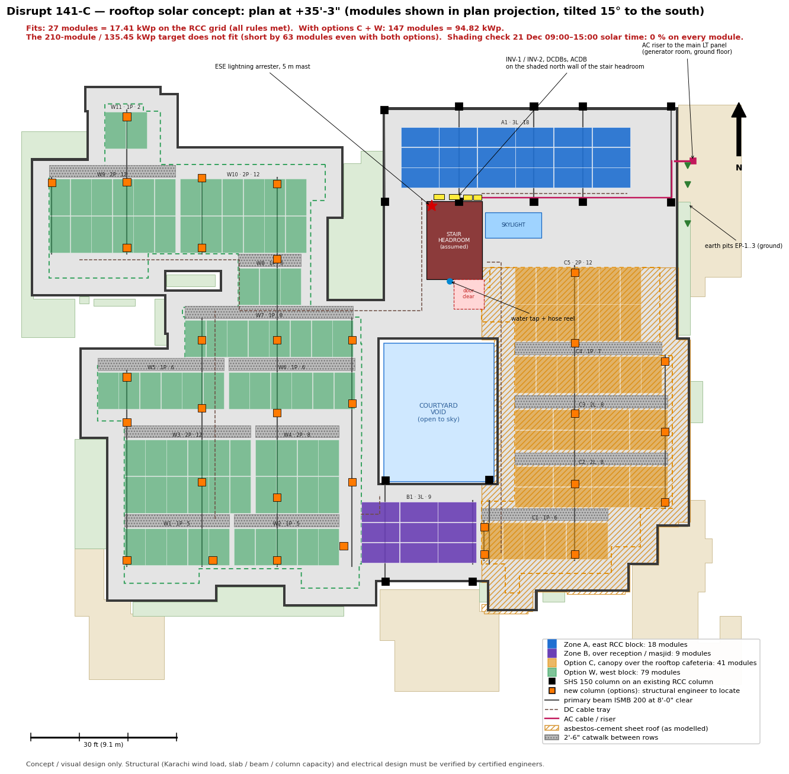
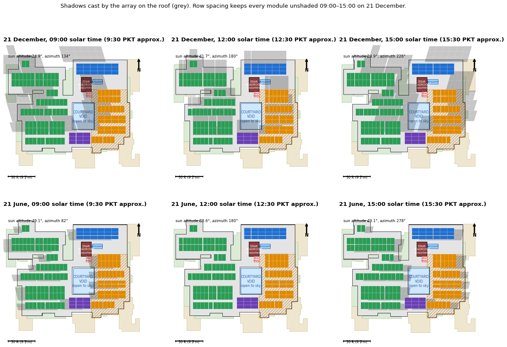

# Disrupt 141-C viewer — HANDOFF v4.0

Made by **Engr. Shamroze Nasir**. The verified v3.4 geometry is unchanged: walls, slabs, rooms, room names, sizes and door/window data. v4.0 adds performance work, a phone layout, wayfinding, a rooftop solar concept and the Phase 5 extras around that model.

## Files

| File | What it is |
|---|---|
| `Disrupt_141C_viewer_v4.0.html` | The viewer (3.4 MB). It is one file and runs offline: double-click to open it. |
| `index.html` | A small start page for web hosting. It forwards to the viewer and keeps `?to=` and other links. |
| `manifest.webmanifest`, `sw.js`, `icons/` | PWA files ("Add to Home Screen" and offline cache). These only work when the folder is served over **https** (or localhost). |
| `screenshots/` | Phone and tablet screenshots (4 devices × portrait/landscape), plus wayfinding, solar and extras shots |
| `solar/` | Roof plan (top view), shading sheet, BoQ CSV, the design numbers (`solar_report.json`) and the Python scripts that produce them |
| `src_v4/` | Module sources and the build scripts |
| `HANDOFF_v4.md` | This file |
| `Disrupt_141C_v4.0_archive_v3.zip` (separate download) | The v3 project archive: briefs, reports, model GLB/OBJ, renders, pipeline, working data, v3 rebuild and verification, HANDOFF v2/v3. The source PDF is not included, as in v3.4 |

**Deploy:** upload the whole folder to any static host (Netlify, Vercel, GitHub Pages, IIS). The link is `https://<host>/` or `…/Disrupt_141C_viewer_v4.0.html`. After publishing, open the QR sheet (menu ☰ → QR codes), type the published address once and press **Update codes**. The printed QR codes will then work on phones.

**Testing note (read this before quoting fps):** every test ran in headless Chromium with **SwiftShader, a software WebGL renderer with no GPU**. Draw calls, triangles, textures, file sizes and load times are exact. Frame times are only useful as before/after *ratios*. Real phone and laptop fps were **not measured**, because no physical device was available. Check them on a real mid-range Android phone (menu → *Show frame rate and draw calls*, or `?stats=1`).

## v4.1 — performance fix (hanging and lag)
- **Shader compilation no longer freezes the page.** three.js read the shader logs synchronously every time a new material was used (entering walk mode, changing floors), which forced the browser to wait for each compile. That is now off, and the walk-mode materials are compiled in the background right after loading. In the test this removed about 19 s of blocking.
- **Dynamic resolution bug fixed.** Frames capped at 30 fps while idle were counted as "slow", so the resolution kept dropping and the canvas was resized every second while you moved, which caused stutter. Only real, back-to-back frames count now, and the resolution comes back up.
- **Auto quality is lighter.** Laptops now start on **Medium** (not High) and phones on **Low**. If a device is still too slow, Auto steps down on its own. High is still available in the panel.
- **Offline cache:** the page is now fetched from the network first, so a new deploy shows up immediately.
- If a browser still shows the old version: hard refresh once (Ctrl+Shift+R), or clear the site data.

---

## Phase 1 — Performance

What was done:

- **Adaptive quality: Auto / High / Medium / Low** (panel → Quality; or `?q=low|medium|high`). Auto picks the level from the device type, `deviceMemory` and CPU cores. Phones get Low or Medium.

  | Setting | High | Medium | Low |
  |---|---|---|---|
  | Pixel ratio cap | 2 desktop / 1.5 phone | 1.5 | 1 desktop / 1.25 phone |
  | Shadow map | 2048, soft | 1024, PCF | off |
  | Detail | full | 0.6× tessellation | 0.4× tessellation, lite shader, small props removed, fewer people variants |

- **Dynamic resolution:** the render scale drops (to 0.55) when frames are slow and recovers when they are fast.
- **Shadows are baked.** `shadowMap.autoUpdate = false`, and the map is re-rendered only when the sun, the time of day or what is visible changes.
- **Render on demand:** a frame is drawn only when the camera moves, input arrives or an animation runs. The page is capped at 30 fps when idle, keeps a 1 fps heartbeat, and draws nothing when the tab is hidden (`visibilitychange`).
- **Culling:**
  - In walk mode only the current floor's furniture is drawn (High also draws the adjacent floors).
  - People are hidden in the exterior orbit on Low.
  - Interior lights come from a fixed pool of 6 / 2 / 0 lights (High / Medium / Low) on the current floor. The fixed pool is also what fixed the old "hang": v3.4 recompiled shaders every time lights switched.
  - Frustum culling is on.
- **Materials:** the model uses only MeshStandard, no MeshPhysical. Glass shares one material. Antialias is off on phones.
- **Draw calls:** furniture and people are InstancedMesh (≈5,000 instances in about 250 meshes). Walls, slabs and glazing are one merged mesh per group.
- **Size:**
  - The model GLB was stripped of meshes that the verified clean geometry replaces.
  - The drawing underlays were converted to WebP q72 and are downscaled per level (1536 / 2048 / 4096 px).
  - Data sits in non-executed `<script type="application/json">` blocks, so the page parses fast.
  - Result: 5.5 MB → 3.4 MB.
- **Loading:** a progress bar, the shell first, then the furniture streamed in 24 ms slices, then the walk scene.

### Before / after (measured)

| | v3.4 desktop | v4.0 desktop Auto (=Medium) | v4.0 desktop High | v3.4 phone emul. | v4.0 phone Auto (=Low) | v4.0 phone Medium |
|---|---|---|---|---|---|---|
| HTML size | 5.5 MB | 3.38 MB | 3.38 MB | 5.5 MB | 3.38 MB | 3.38 MB |
| DOMContentLoaded | 7.0 s | 1.8 s | 2.3 s | 15.9 s | 2.3 s | 3.0 s |
| First view (model on screen) | 18.8 s | 9.5 s | 14.9 s | 32.5 s | 2.7 s | 4.6 s |
| Fully loaded (furniture + walk scene) | 18.8 s | 28.8 s | 41.7 s | 32.5 s | 16.5 s | 22.8 s |
| JS heap | 60 MB | 45 MB | 60 MB | 60 MB | 40 MB | 37 MB |
| **Orbit, front 3/4**: draw calls / triangles | 369 / 4.04 M | 298 / 2.02 M | 304 / 3.78 M | 354 / 3.99 M | 196 / 1.03 M | 283 / 2.00 M |
| Orbit, front 3/4: frame time (software GL) | 4.25 s | 3.30 s | 5.25 s | 18.06 s | 1.51 s | 3.24 s |
| **Walk, reception (GF)**: draw calls / triangles | 375 / 3.93 M | 139 / 0.47 M | 133 / 0.89 M | 298 / 3.71 M | 86 / 0.35 M | 94 / 0.43 M |
| Walk, reception (GF): frame time (software GL) | 7.03 s | 2.76 s | 3.44 s | 13.63 s | 1.08 s | 2.00 s |
| **Walk, FF workstations**: draw calls / triangles | 251 / 3.43 M | 95 / 0.82 M | 172 / 2.29 M | 217 / 3.08 M | 69 / 0.66 M | 77 / 0.80 M |
| Walk, FF workstations: frame time (software GL) | 4.62 s | 3.53 s | 4.89 s | 17.63 s | 1.75 s | 3.22 s |
| **Architect, GF plan cut**: draw calls / triangles | 225 / 1.19 M | 198 / 0.59 M | 202 / 1.05 M | 213 / 1.18 M | 182 / 0.52 M | 186 / 0.59 M |
| Architect, GF plan cut: frame time (software GL) | 1.55 s | 1.80 s | 2.26 s | 11.46 s | 1.77 s | 3.04 s |
| Pixel ratio / canvas | 1 / 1440×900 | 1 / 1440×900 | 1 / 1440×900 | 2 / 824×1830 | 1.25 / 515×1143 | 1.5 / 618×1372 |

The runs used headless Chromium with SwiftShader. "Phone emulation" means a Pixel 7 viewport, a mobile user agent and touch, with the **CPU throttled 4×**. Frame time is the software-renderer time for one full frame, so read it as a ratio only.

- **Phone, walk mode:** frame work drops about **12.7×** (13.6 s → 1.08 s per software frame at reception, 17.6 s → 1.75 s in the FF workstations). Draw calls fall from 298 to 86 and triangles from 3.7 M to 0.35 M.
- **Desktop Auto:** 2.5× less frame work when walking, and 2.0 M instead of 4.0 M triangles in orbit.
- **High** keeps the v3.4 detail (3.8 M triangles in orbit) with 304 calls, instead of the 369 calls v3.4 made.
- **Draw calls:** every v4 scene is under 300 on Auto, Medium and Low. High orbit is 304, within 2 % of the target.
- **First view:** 2.7 s on the phone profile (target under 5 s). The desktop numbers (9.5 s Auto, 14.9 s High) are inflated by software rendering of the first frame.
- **Load time and size:** DOMContentLoaded went from 7–16 s to about 2 s, and the file from 5.5 MB to 3.4 MB.
- **Target fps:** 30 fps on a mid-range Android and 60 fps on a laptop are *expected* from these reductions, but they were **not verified on a real device**. Please check with `?stats=1`.
- **Heat:** render-on-demand means nothing is drawn while the view is still (a 1 fps heartbeat only) and nothing at all while the tab is hidden. This, not raw speed, is what keeps a phone cool.
- **Where v4 is slower:** *Fully loaded* takes longer on desktop (28.8 s against 18.8 s in the software renderer). The furniture is now streamed in small slices after the first view, so the building shows sooner and the page stays responsive, but the last chair arrives later. The desktop Architect view costs about 16 % more frame time on Auto. I have not traced the cause; it still draws under 200 calls.

Draco/meshopt was **not** applied. After the stripping, the shell GLB is 118 KB (it was 887 KB), which is less than a Draco decoder would add. Most of the page size is now the three WebP drawing underlays (≈1.7 MB) and three.js itself. FXAA (optional in the brief) was not added.

---

## Phase 2 — Mobile

- **Phones (≤ 820 px, or landscape under 500 px high):**
  - compact top bar and a ☰ menu;
  - the left panel becomes a **bottom sheet**: drag or tap the handle, three stops (peek / half / full);
  - the time-of-day bar moves into the sheet.
- **Touch targets and text:** every control is at least 44 × 44 px and text is at least 14 px. The automatic audit in `devices.py` checks every visible element for overflow, small targets and tiny text.
- **Orbit:** one finger rotates, two fingers pinch and pan, and a double-tap zooms towards the tapped point.
- **Walk:**
  - left joystick, drag anywhere else to look;
  - ▲ / ▼ Floor (nearest stair) and 🏃 Run buttons;
  - everything sits inside `env(safe-area-inset-*)`;
  - keyboard hints are hidden on touch screens and touch hints are shown instead.
- **Building map:** pinch, pan, and tap a room to open its card (name, size, *Show me the way*, *Take me there*).
- **Resizing:** the canvas follows `visualViewport` (orientation change, address bar), debounced.
- **Architect view + Measure on phones:** tap-tap to measure. The points **snap to the nearest wall face** within 0.6 ft (1.2 ft on touch), and the label says "snapped to wall".
- **Devices tested:** iPhone SE 375×667, iPhone 14 390×844, Pixel 7 412×915 and iPad 768×1024, each in portrait and landscape. Screens covered: home, sheet, walk, map, architect, menu, wayfinding and solar. Screenshots are in `screenshots/devices/`.

---

## Phase 3 — Wayfinding

- **🔍 Where to? / کہاں جانا ہے؟** is on the top bar, in walk mode and in the menu.
  - Search matches department, room name or size (for example "CCTV", "board", `13'-0"`).
  - The department list (23) is built from the room data, shows the floors for each, and has Urdu names.
- **From:**
  - 🚪 Main gate (the default);
  - 📍 Where I am (in walk mode);
  - 👆 Tap on the map (*Main yahan hoon*).
- **Route:**
  - A* on the walk grid, across floors through the stair with the lowest cost. The instructions name the stair.
  - The route is drawn as a glowing, animated chevron ribbon. A faint x-ray copy shows the part hidden behind walls when you look from above.
  - An orange pin marks the destination.
- **Views:** 👁 Eye level / 🦅 Bird's-eye / ⊞ Plan.
  - Bird's-eye puts the camera 30 ft up and 21 ft behind, looking down at about 55°.
  - The floors, slabs and roofs above the walker are hidden, so the rooms and the blue avatar are visible.
  - If a wall would block the view, the camera tilts steeper (6 ft behind, 36 ft up) instead of going into the wall.
  - The avatar's ring and heading arrow draw on top.
- **▶ Take me there / وہاں لے چلو:**
  - The avatar walks the route at 4.8 ft/s. Speed is 0.5× to 3×, with pause.
  - Stair changes fade through.
  - Any joystick or WASD input hands control back to you.
- **Directions:** turn-by-turn, for example "Go straight 45 ft, then turn right", "Take the Main stair up to the second floor". They are simplified with Douglas-Peucker, so small wiggles do not become turns. There is a full list (≡). On arrival a card opens with the room, floor and size.
- **Minimap:** the current floor, a blue dot with a heading cone, and the route line with its end point. Tap it to open the big map.
- **🚨 Emergency:**
  - Shows a red route to the nearest emergency or fire exit on your floor, or out at ground level through a stair.
  - From outside walk mode you tap where you are.
  - `?sos=1&from=<department>` gives the way out from that room. Print these QR codes and post one in each department.
- **QR sheet:** ☰ → *QR codes for every department* makes a printable sheet with one code per department (directions from the main gate) and one emergency code per department. The codes decode correctly (checked with OpenCV).

**Deep links** (add to the viewer address):
`?to=<key>` routes from the main gate.
- `&from=<key>` sets another start point.
- `&view=eye|bird|plan` sets the view.
- `&go=1` starts the auto-walk.
- `?sos=1` is the emergency route (tap your position).
- `?sos=1&from=<key>` is the emergency route from that room.

| Department | اردو | Floor(s) | Rooms | Link |
|---|---|---|---|---|
| Reception | استقبالیہ | Ground | 2 | `?to=reception` |
| Main gate & guard post | مین گیٹ | Ground | 1 | `?to=main-gate` |
| Admin offices | ایڈمن آفس | Ground | 3 | `?to=admin` |
| Procurement | پروکیورمنٹ | Ground | 2 | `?to=procurement` |
| Board room | بورڈ روم | Ground | 1 | `?to=board-room` |
| Meeting rooms & huddles | میٹنگ روم | Ground / First / Second | 29 | `?to=meeting-rooms` |
| Work stations | ورک اسٹیشن | Ground / First / Second | 39 | `?to=work-stations` |
| Reading room | ریڈنگ روم | Ground | 1 | `?to=reading-room` |
| Gym | جم | Ground | 2 | `?to=gym` |
| Day care | ڈے کیئر | Ground | 1 | `?to=day-care` |
| Medical assist | طبی امداد | Ground | 1 | `?to=medical-assist` |
| Masjid & prayer areas | مسجد اور نماز | Ground / Second | 4 | `?to=prayer` |
| Rooftop cafeteria | کیفے ٹیریا | Second | 1 | `?to=cafeteria` |
| Refreshment & dining | ریفریشمنٹ | Ground | 2 | `?to=refreshment` |
| Recreation, gaming & sitting | تفریح | Ground / Second | 3 | `?to=recreation` |
| Server room | سرور روم | First | 1 | `?to=server-room` |
| IT room | آئی ٹی روم | First | 1 | `?to=it-room` |
| CCTV room | سی سی ٹی وی روم | Ground | 1 | `?to=cctv-room` |
| UPS room | یو پی ایس روم | Ground | 1 | `?to=ups-room` |
| Workshop | ورکشاپ | Ground | 1 | `?to=workshop` |
| Generator room & gen store | جنریٹر روم | Ground | 2 | `?to=generator` |
| Washrooms | واش روم | Ground / First / Second | 10 | `?to=washrooms` |
| Stores | اسٹور | Ground / Second | 5 | `?to=stores` |

All room links (129)

| Link | Room | Floor | Size |
|---|---|---|---|
| `?to=main-gate-and-guard-post` | Main gate & guard post | GF | GUARD 6'-0" × 6'-0" (A-101) |
| `?to=entrance-foyer` | Entrance foyer | GF | 19'-0" × 8'-11" |
| `?to=entrance-porch` | Entrance porch (covered) | GF | 24'-7" × 8'-6" (A-111; plus 3'-8" of steps up to the reception) |
| `?to=lawn` | Lawn | GF | 30'-6" × 19'-0" |
| `?to=green-lawn` | Green lawn | GF | size not given on drawing |
| `?to=reception-area` | Reception area (double height) | GF | 20'-6" × 21'-5" |
| `?to=board-room` | Board room | GF | 23'-6" × 18'-0" |
| `?to=huddle` | Huddle | GF | 8'-3" × 5'-0" |
| `?to=procurement-office` | Procurement office | GF | 13'-2" × 8'-11" |
| `?to=admin-office` | Admin office | GF | 13'-2" × 8'-10" |
| `?to=admin-office-gf` | Admin office | GF | 11'-4" × 10'-0" |
| `?to=admin-check-in-out` | Admin check in / out | GF | 13'-8" × 8'-6" |
| `?to=procurement-store` | Procurement store | GF | 18'-10" × 15'-6" |
| `?to=visitor-executive` | Visitor / executive | GF | 11'-0" × 5'-1" |
| `?to=meeting-room` | Meeting room | GF | 20'-7" × 14'-0" |
| `?to=reading-room` | Reading room | GF | 20'-7" × 19'-4" |
| `?to=workshop` | Workshop | GF | 18'-8" × 7'-9" |
| `?to=cctv-room` | CCTV room | GF | 13'-0" × 8'-11" |
| `?to=ups-room` | UPS room | GF | 13'-0" × 6'-3" |
| `?to=admin-guard-washroom` | Admin / guard washroom | GF | 2 W/C 5'-3" × 4'-0" |
| `?to=gym` | Gym | GF | 36'-0" × 19'-11" |
| `?to=generator-room` | Generator room | GF | 21'-7" × 13'-11" |
| `?to=gen-store` | Gen store | GF | 13'-3" × 5'-6" |
| `?to=sitting` | Sitting | GF | 11'-0" × 10'-2" |
| `?to=water-pumps-and-tools` | Water pumps & tools | GF | 11'-0" × 9'-3" |
| `?to=gym-store` | Gym store | GF | 5'-0" × 9'-3" |
| `?to=gaming-room` | Gaming room | GF | 11'-9" × 14'-10" |
| `?to=shower-and-changing` | Shower & changing | GF | 18'-7" × 14'-9" |
| `?to=admin-dining-rest-area` | Admin dining / rest area | GF | 13'-2" × 14'-9" |
| `?to=refreshment-area` | Refreshment area (vending / tea) | GF | red note: vendi / coffee machine / tea counter |
| `?to=medical-assist` | Medical assist | GF | 19'-4" × 8'-4" |
| `?to=day-care` | Day care | GF | 20'-3" × 14'-9" |
| `?to=female-staff-common-room-prayer-area` | Female staff common room / prayer area | GF | 18'-2" × 15'-0" |
| `?to=janitorial` | Janitorial | GF | 6'-6" × 6'-0" |
| `?to=female-toilet` | Female toilet | GF | 7'-0" × 15'-0" |
| `?to=executive-bath` | Executive bath | GF | 10'-1" × 5'-0" |
| `?to=workstations` | Workstations | GF | 15'-1" × 19'-8" |
| `?to=male-toilet` | Male toilet | GF | 17'-9" × 16'-7" (named on A-111; A-101 shows the WCs without a label) |
| `?to=work-stations` | Work stations | GF | 15'-10" × 22'-8" |
| `?to=work-stations-gf` | Work stations | GF | 11'-6" × 15'-7" |
| `?to=lobby` | Lobby | GF | 8'-1" × 6'-9" |
| `?to=lobby-gf` | Lobby | GF | 11'-6" × 6'-3" |
| `?to=office` | Office | GF | 6'-5" × 13'-10" |
| `?to=huddle-hub` | Huddle hub | GF | 19'-7" × 11'-10" |
| `?to=work-stations-gf-55` | Work stations | GF | 16'-1" × 13'-11" |
| `?to=office-gf` | Office | GF | 6'-9" × 10'-1" |
| `?to=work-station` | Work station | GF | 11'-6" × 26'-11" |
| `?to=workstation` | Workstation | GF | 11'-4" × 15'-3" |
| `?to=huddle-hub-gf` | Huddle hub | GF | 8'-0" × 13'-5" |
| `?to=workstation-gf` | Workstation | GF | 24'-9" × 11'-4" |
| `?to=work-stations-gf-61` | Work stations | GF | 8'-7" × 13'-5" |
| `?to=work-station-gf` | Work station | GF | 15'-3" × 14'-10" |
| `?to=north-west-courtyard` | North-west courtyard | GF | 16'-3" × 8'-3" |
| `?to=service-stair-lobby` | Service stair lobby | GF | to the service stair and generator room |
| `?to=unlabelled-room` | Unlabelled room | GF | 6'-6" × 4'-10" (size only, no name on A-101 / A-111) |
| `?to=unlabelled-room-gf` | Unlabelled room (basins) | GF | 6'-6" × 9'-8" |
| `?to=work-stations-ff` | Work stations (36 persons) | FF | 52'-2" × 19'-5" |
| `?to=huddle-ff` | Huddle | FF | 3'-3" × 7'-0" |
| `?to=meeting-room-ff` | Meeting room | FF | 9'-0" × 9'-9" |
| `?to=meeting-room-ff-4` | Meeting room | FF | 9'-0" × 9'-2" |
| `?to=meeting-room-ff-5` | Meeting room (4 pax) | FF | 8'-5" × 9'-9" |
| `?to=meeting-room-ff-6` | Meeting room (8 pax) | FF | 7'-9" × 11'-6" |
| `?to=meeting-room-ff-7` | Meeting room (7 pax) | FF | 7'-9" × 11'-6" |
| `?to=meeting-room-ff-8` | Meeting room (4 pax) | FF | 7'-9" × 11'-6" |
| `?to=work-stations-ff-9` | Work stations (23 pax) | FF | 10'-7" × 35'-8" |
| `?to=work-stations-ff-10` | Work stations (16 pax) | FF | 19'-4" × 14'-11" |
| `?to=work-stations-ff-11` | Work stations | FF | 16'-5" × 15'-10" |
| `?to=room-marked-6s` | Room marked 6S | FF | 10'-7" × 6'-10" (no room name on A-102 / A-112) |
| `?to=green-area-with-shade` | Green area with shade | FF | terrace |
| `?to=huddle-ff-16` | Huddle | FF | 5'-10" × 5'-2" |
| `?to=huddle-ff-17` | Huddle | FF | 6'-1" × 5'-2" |
| `?to=female-bath-room` | Female bath room | FF | 11'-10" × 13'-11" |
| `?to=male-bath-room` | Male bath room | FF | 18'-10" × 15'-6" |
| `?to=server-room` | Server room | FF | 11'-4" × 15'-7" |
| `?to=work-stations-ff-23` | Work stations | FF | 13'-5" × 15'-8" |
| `?to=work-stations-ff-25` | Work stations | FF | 16'-2" × 7'-7" |
| `?to=work-stations-ff-26` | Work stations | FF | 15'-9" × 12'-4" |
| `?to=work-stations-ff-27` | Work stations (17 pax) | FF | 17'-7" × 28'-7" |
| `?to=it-room` | IT room (follow existing layout) | FF | 16'-6" × 16'-0" |
| `?to=workstation-ff` | Workstation | FF | 16'-6" × 11'-8" |
| `?to=huddle-ff-30` | Huddle | FF | 5'-10" × 7'-0" |
| `?to=huddle-ff-31` | Huddle | FF | 3'-8" × 7'-0" |
| `?to=work-stations-ff-32` | Work stations | FF | 14'-11" × 28'-10" |
| `?to=work-stations-ff-34` | Work stations | FF | 19'-6" × 23'-8" |
| `?to=huddle-ff-35` | Huddle | FF | 7'-0" × 3'-8" |
| `?to=work-stations-ff-36` | Work stations | FF | 18'-2" × 25'-7" |
| `?to=huddle-hub-ff` | Huddle hub | FF | 7'-0" × ≈3'-4" (7'-0" on A-112; the depth figure is hidden under the label, 3'-4" measured) |
| `?to=work-stations-ff-38` | Work stations | FF | 18'-3" × 19'-2" |
| `?to=huddle-ff-39` | Huddle | FF | 6'-0" × 4'-0" |
| `?to=huddle-ff-40` | Huddle | FF | 6'-0" × 4'-0" (drawn grey) |
| `?to=meeting-room-ff-41` | Meeting room | FF | 11'-6" × 11'-9" |
| `?to=workstation-ff-42` | Workstation | FF | 19'-6" × 13'-6" |
| `?to=workstation-ff-43` | Workstation (8 pax) | FF | 24'-5" × 13'-6" |
| `?to=huddle-ff-44` | Huddle | FF | 8'-6" × 6'-0" |
| `?to=green-area` | Green area | FF | terrace |
| `?to=work-stations-ff-46` | Work stations | FF | 7'-9" × 15'-11" |
| `?to=work-stations-ff-47` | Work stations | FF | 11'-3" × 15'-5" |
| `?to=room` | Room | FF | 12'-10" × 12'-5" |
| `?to=workstation-ff-49` | Workstation (10 pax) | FF | 18'-3" × 13'-1" |
| `?to=work-stations-sf` | Work stations (32 persons) | SF | 48'-0" × 20'-1" |
| `?to=huddle-sf` | Huddle | SF | 3'-3" × 7'-0" |
| `?to=meeting-room-sf` | Meeting room | SF | 8'-4" × 10'-0" |
| `?to=female-bath-room-sf` | Female bath room | SF | 13'-2" × 12'-10" |
| `?to=male-bath-room-sf` | Male bath room | SF | 13'-2" × 17'-5" |
| `?to=open-handwash` | Open handwash | SF | 15'-1" × 8'-1" |
| `?to=recreational-area` | Recreational area | SF | 27'-2" × 19'-2" |
| `?to=rooftop-cafeteria` | Rooftop cafeteria (70 persons) | SF | 24'-1" × 53'-1" |
| `?to=store-room` | Store room | SF | 12'-3" × 17'-5" |
| `?to=store-room-sf` | Store room | SF | 12'-3" × 12'-2" |
| `?to=store-room-sf-16` | Store room | SF | 12'-3" × 16'-4" |
| `?to=masjid-prayer-area` | Masjid / prayer area (Block D) | SF | 19'-6" × 16'-7" |
| `?to=ablution` | Ablution | SF | 7'-6" × 13'-7" |
| `?to=shoe-rack` | Shoe rack | SF | 11'-6" × 12'-6" |
| `?to=work-stations-sf-20` | Work stations (20 pax) | SF | 19'-9" × 26'-6" |
| `?to=huddle-hub-sf` | Huddle hub (10 pax) | SF | 10 pax |
| `?to=work-stations-sf-22` | Work stations | SF | 19'-5" × 15'-2" |
| `?to=work-stations-sf-23` | Work stations (20 pax) | SF | 26'-11" × 15'-10" |
| `?to=room-marked-6s-sf` | Room marked 6S | SF | 10'-7" × 6'-0" (no room name on A-103 / A-113) |
| `?to=work-stations-sf-25` | Work stations (14 pax) | SF | 18'-1" × 15'-10" |
| `?to=fire-exit` | Fire exit | SF | size not given on drawing |
| `?to=work-stations-sf-28` | Work stations (19 pax) | SF | 29'-6" × 13'-10" |
| `?to=work-stations-sf-29` | Work stations (14 pax) | SF | 16'-3" × 14'-7" |
| `?to=work-stations-sf-30` | Work stations (5 pax) | SF | 11'-4" × 9'-9" (dimensions only; desks and 5 PAX drawn) |
| `?to=work-stations-sf-31` | Work stations (7 pax) | SF | 10'-0" × 16'-8" (dimensions only; desks and 7 PAX drawn) |
| `?to=work-stations-sf-32` | Work stations (22 pax) | SF | 12'-11" × 14'-9" (A-113: 12'-11" wide; 8'-3" + 3'-0" + 3'-6" deep) |
| `?to=work-stations-sf-33` | Work stations | SF | 18'-11" × 16'-7" |
| `?to=work-stations-sf-34` | Work stations | SF | 12'-0" × 13'-11" |
| `?to=steps-to-the-west-block` | Steps to the west block | SF | 12'-1" × 29'-0" (A-113) |
| `?to=meeting-room-sf-37` | Meeting room | SF | 8'-9" × 10'-0" (drawn grey on A-103, open to the workstations) |

---

## Phase 4 — Rooftop solar (135 kWp brief), elevated structure

> **⚠ Concept / visual design only.** The structural design (Karachi wind load, and slab, beam and column capacity) and the electrical design must be verified by a certified structural engineer and a certified electrical engineer before anything is priced or built. The same line appears in the viewer's solar panel.

### Result, stated plainly

**210 modules (135.45 kWp) do not fit on this roof under the rules in the brief.**

| Scope | Modules | kWp | Status |
|---|---|---|---|
| **A** East RCC block roof, +35'-3" | 18 | 11.61 | All rules met; SHS columns sit on existing RCC columns |
| **B** Bay over the reception / masjid, +35'-3" | 9 | 5.81 | All rules met; 4 existing RCC columns |
| **D** South-east single-storey roof, +12'-5" | 0 | 0 | Studied. After the 1 m edge setback the strip on the proposed RCC columns is too narrow |
| **Rules met (A + B)** | **27** | **17.41** | |
| **Option C** Canopy over the rooftop cafeteria / recreation area (your fallback) | 41 | 26.45 | The zone has **no RCC columns**, so new columns are needed (engineer to locate). The zone is roofed with **asbestos-cement sheet**, which a licensed contractor must remove first |
| **Option W** West block roof | 79 | 50.96 | **No RCC columns** on A-113; the existing structure is load-bearing walls. New columns (placed over the second-floor wall lines in the model) need a structural survey |
| **Everything that physically fits** | **147** | **94.82** | Short of the target by **63 modules / 40.6 kWp** |

The limit is area, not shading. When I relaxed the shading window to 10:00–14:00, or reduced the tilt to 10°, the layout gained only 4 modules (151). What takes the space:

- the 1 m parapet setback;
- the courtyard void;
- the skylight;
- the stair headroom and its door;
- the asbestos-sheet zone;
- above all, the lack of RCC columns outside the east block.

Ways to reach 135 kWp (outside this brief):

- use 700–720 Wp modules of the same size (147 × 715 W ≈ 105 kWp);
- add a ground-level solar carport over the compound;
- accept a smaller no-shade window.

### Roof survey (from the model, A-113, A-301 / A-302)

| Item | Area / size | Source |
|---|---|---|
| +35'-3" roof deck inside the parapets | **10,676 sq ft** | model slabs minus parapets (4'-0" high, top +39'-3") |
| After a 1 m (3'-3") setback from every parapet | 8,160 sq ft | |
| After obstructions (void, skylight, stair headroom, door landing, light well) | **7,734 sq ft** | |
| Of which not under asbestos sheet | 5,653 sq ft | |
| Asbestos-cement sheet zone (east; boundary not drawn on the set) | 2,690 sq ft | sections tag "asbestos sheet" at +35'-3" |
| Courtyard void, open to the sky (23'-0" × 28'-4" as modelled; A-113 notes 23'-0" × 28'-10") | 652 sq ft, kept clear + 1 m | A-111 / A-113 |
| Skylight next to the main stair, 11'-7" × 5'-2" (A-113) | 60 sq ft, kept clear + 0.6 m | A-113. The brief says 6'-2"; A-113 reads 5'-2" |
| Main stair headroom (mumty) over the stair, 11'-5" × 16'-2", assumed 9'-0" high | 184 sq ft | The stair reaches the roof in the model; **there is no roof plan in the set**, so the headroom is an assumption |
| Roof door landing in front of the headroom (south face) | 6'-2" × 6'-0", kept clear | |
| Service stair | outside the +35'-3" roof (east, reaches the terraces) | A-113 |
| Water tanks | **none shown on any sheet**; the drawings show only an underground tank | A-111 |

### Layout rules applied

| Rule | How it was applied |
|---|---|
| Orientation | Tilt 15°, azimuth 180°. The set has no north point, so the model assumes +Y = north (entrance on the south). **Confirm north on site**; a large rotation changes the layout |
| Clear height | 8'-0" clear under the lowest steel member; module low edge ≈ 9'-4" above the roof |
| Columns | HDG SHS 150×150×6 only at the RCC column positions drawn on A-111/112/113 (zones A, B). Cantilevers ≤ 1.5 m past a column line |
| Setback | 1 m from every parapet inner face; also 1 m from the courtyard void and the light well |
| Walkways | 2'-6" catwalk (HDG grating, handrail) in the gap behind every row that has another row behind it |
| Tables | The optimiser tried 2P, 3L, 2L and 1P rows per strip and kept whichever fitted most: A and B use 3L, C and W mix 2P / 2L / 1P |
| Shading | Row pitch from the 21 Dec sun at 09:00 and 15:00 solar time (altitude 24.9°): gap = 1.51 × the table rise (2P: 6'-1", 3L: 5'-0"). Every module was then **ray-cast** against every other table, the headroom and the building every 10 min from 09:00 to 15:00: **0 % shaded**. The viewer re-checks this live: 0 of 147 at 09:30 PKT, 51 of 147 at 08:00 PKT (before the window, as expected) |
| Kept clear | courtyard void, skylight, stair door and landing; no table over any exit or stair headroom |

### Structure (concept)

- **Columns:**
  - SHS 150×150×6 HDG, from the roof to the underside of the beams (8'-0");
  - base plate 350×350×20 with 4 × M20 chemical anchors into the RCC column head, after coring the roof finish, with a waterproofing collar;
  - 14 columns for A + B, 47 for all zones (33 of them new, in C and W).
- **Primary beams:** ISMB 200 on the column lines.
- **Secondary beams:** ISMC 125 under the front and back of each table.
- **Rafters and posts:** C 100×50×20×2.5 rafters at ≤ 2.5 m, on SHS 50 posts.
- **Purlins:** C 100×50×20×2.0 lipped purlins, 2 per module row.
- **Modules:** clamped to the purlins with aluminium mid and end clamps.
  - Separate aluminium rails are not needed, because the purlins do that job.
  - If the installer prefers rails, add ≈ 486 m of rail.
- **Steel estimate** (±30 %, including 10 % for plates and bracing): **3.7 t for A + B**, **17.2 t for all zones**.
- **Loads:** the modules add about 11 kg/m² and the steel about 38–44 kg/m² of array, as point loads at the columns. Wind uplift at about 13 ft above the roof is the governing case and must be checked (Karachi basic wind speed, BCP/ASCE 7).

### Electrical (concept, all zones = 147 modules)

**Module assumed:** 645 Wp bifacial, 132 half-cut cells (210 mm).

- Voc 44.9 V, Vmp 37.6 V, Isc 18.30 A, Imp 17.16 A
- βVoc −0.25 %/°C, βVmp −0.29 %/°C, γPmax −0.34 %/°C, bifaciality 70 %
- **Replace these with the chosen datasheet.**

**String length:**

- Voc cold at 0 °C (the Karachi record low) = 44.9 × (1 + 0.0025 × 25) = **47.71 V per module**.
- 1100 V / 47.71 = **23 modules maximum** in series.
- Vmp hot at 75 °C cell = 37.6 × (1 − 0.0029 × 50) = 32.15 V. To stay at or above the 480 V full-power MPPT limit you need **at least 15** in series.

| Inverter | AC | Zones | Modules / kWp | Strings | Voc at 0 °C | Vmp at 75 °C | DC/AC |
|---|---|---|---|---|---|---|---|
| INV-1 | 40 kW | A, B, C | 68 / 43.86 | 4 × 17 | 811 V | 547 V | 1.10 |
| INV-2 | 50 kW | W | 79 / 50.95 | 3 × 20 + 1 × 19 | 954 V / 906 V | 643 V | 1.02 |

- **Inverter spec:** three-phase 400 V string inverters, 1100 V DC max, ≥ 4 MPPT (one string per MPPT), ≥ 20 A per string input (bifacial Isc), IP66.
- **Where the equipment goes:**
  - both inverters, the two DCDBs (DC isolator and Type II DC SPD per string) and the solar ACDB hang on the **north wall of the stair headroom**, shaded by the headroom and the array;
  - there is clear floor space under them.
- **Stage 1 (A + B only, 27 modules, 17.4 kWp):** one 15 kW inverter with two strings, 18 + 9, on separate MPPTs.
- **DC:**
  - 6 mm² PV cable, about 443 m (+ and − runs);
  - string voltage drop 0.25–0.79 %;
  - cable runs in HDG perforated trays, 150×50 and 200×50 (about 90 m), fixed under the structure.
- **AC:**
  - 90 kW → 131 A;
  - cable 4C × 70 mm² Cu XLPE/SWA + 35 mm² PE, about 30 m, voltage drop 0.93 %;
  - route: along the headroom → east parapet → **GI trunking riser down the north-east wall** → +12'-5" roof → **generator room** (main LT panel, assumed; the LT panel is not shown on the drawings);
  - 160 A 4P MCCB incomer;
  - net meter (K-Electric) and an export limiter / generator interlock, so the inverters never back-feed the genset.
- **Earthing:**
  - 3 pits (DC / structure, AC, and a separate one for the lightning arrester), 3 m Cu-bonded rods, ≤ 5 Ω, bonded together;
  - 16 mm² Cu bonding of all steel and module frames.
- **Lightning:** ESE arrester on a 5 m mast on the **stair headroom (the highest point)**, 70 mm² Cu down conductor to its own pit.
- **Water:** a ¾" GI line from the booster pump to a tap and a 30 m hose reel at the roof door. Use RO or soft water for cleaning, because Karachi water leaves scale.

### Energy estimate

Method (in `solar/yieldcalc.py`):

- typical long-term monthly GHI for Karachi (≈ 2,000 kWh/m²/yr) and temperatures;
- hourly clear-sky shape, Erbs split, Hay-Davies transposition to 15° south, Faiman cell temperature, PVWatts DC;
- losses: soiling 5 %, mismatch 2 %, DC 1.5 %, AC 1 %, grid outage / load-shedding 3 %, first-year LID 1.5 %, inverter 98 %.

| | kWh/kWp/yr | 27 modules (17.41 kWp) | 147 modules (94.82 kWp) | 210 modules (135.45 kWp, brief) |
|---|---|---|---|---|
| Monofacial basis | **1,621** | 28.2 MWh | **153.7 MWh** | 219.6 MWh |
| With 5 % bifacial gain (8'-0" over a light roof) | 1,702 | 29.6 MWh | 161.4 MWh | 230.5 MWh |

PR ≈ 0.76, POA ≈ 2,131 kWh/m²/yr. These are estimates from a climate model, not from a TMY file. Rerun them in PVsyst or PVGIS before quoting bankable figures.

### Bill of quantities (concept)

The full list is in `solar/solar_BoQ.csv`.

| Item | A + B (rules met) | All zones (A + B + C + W) |
|---|---|---|
| PV modules 645 Wp bifacial | 27 | 147 |
| Columns SHS 150×150×6 HDG (total length) | 14 (34 m) | 47 (115 m) |
| Anchor bolts M20 chemical, 4 per column | 56 | 188 |
| Base plates 350×350×20 | 14 | 47 |
| Primary beams ISMB 200 | 44 m | 161 m |
| Secondary beams ISMC 125 | 52 m | 424 m |
| Rafters C 100×50×20×2.5 | 42 m | 270 m |
| Posts SHS 50×50×3 | 9 m | 57 m |
| Purlins C 100×50×20×2.0 (they also act as rails) | 131 m | 486 m |
| Module clamps (mid + end), Al/SS | 66 | 352 |
| Catwalk 2'-6" grating + handrail | — | 101 m |
| Structural steel total (+10 %) | 3.7 t | 17.2 t |
| String inverters | 1 × 15 kW (est.) | 40 kW + 50 kW |
| DCDB string ways (isolator + SPD) | 2 | 8 |
| PV cable 6 mm² | ≈ 120 m (est.) | ≈ 443 m |
| AC cable 4C × 70 mm² Cu + PE | 30 m | 30 m |
| Cable tray HDG / riser trunking | ≈ 40 m / 11 m | ≈ 90 m / 11 m |
| Earth pits / bonding | 3 / lot | 3 / lot |
| ESE lightning arrester + mast + down conductor | 1 | 1 |
| Water tap + hose reel | 1 | 1 |

### In the viewer

- **Panel → Rooftop solar:** ☀ *Show the 135 kWp concept*, *Solar view*, *Walk under the panels*. The same actions are in the ☰ menu, and `?solar=1` opens it directly.
- **The layer:**
  - all 147 modules are one **InstancedMesh** with a cell and frame texture;
  - the steel is 5 instanced meshes, light grey HDG;
  - existing-column supports are grey and **new columns are orange**;
  - the layer also shows the catwalks, stair headroom and door, skylight, inverters, DCDB/ACDB, trays, riser, arrester mast and tap, with labels.
- **The info card:**
  - modules and kWp for what is shown, with the honest target line;
  - the zone table, orientation and roof coverage;
  - layout, structure, electrical and energy notes, the BoQ, and the disclaimer;
  - Options C and W can be switched on and off.
- **Shading view:** 21 Dec / 21 Jun with an hour slider (PKT and solar time).
  - The scene's sun follows the slider (real shadows on High and Medium).
  - Module shadows are drawn on the roof.
  - Every module is ray-checked live; shaded modules turn red, and the count is shown.
- **Walk under the panels:** puts you on the +35'-3" roof at eye height, under the 8'-0" structure, starting at the inverters. The roof deck and the parapets hold you in. The floor switcher's **R** button does the same.

| | |
|---|---|
|  |  |
|  |  |
|  |  |

**Assumptions to confirm on site:**

1. true north;
2. the stair headroom and roof door (no roof plan in the set);
3. which RCC columns continue to the roof slab (A-113 shows columns only in the east block);
4. the extent of the asbestos sheet;
5. the roof waterproofing under each base plate;
6. that no water tanks or plant are on the roof;
7. the module and inverter datasheets.
---

## Phase 5 — Extras

- **Floor switcher R / 2 / 1 / G** is always on screen (right edge; on phones above the sheet or under the walk bar). The current floor is highlighted.
  - **Orbit:** a cutaway at that floor; R shows the full building (and the solar layer if it is on).
  - **Walk:** changes floor by the nearest stair; R walks under the solar array.
  - **Architect:** sets the plan cut.
  - **Building map:** switches the map's floor.
- **Share (🔗, panel or ☰):** builds a link with the camera, or the walk position, heading and view, plus the mode, the selected room, the active route, the solar layer, the date and hour, and the language.
  - Copy, native share, and a QR code.
  - Opening the link restores all of it.
  - Parameters: `cam=x,y,z,tx,ty,tz` · `fov` · `mode` · `walk=GF,x,y,yaw,pitch` · `wview` · `roof=1` · `room=GF.8` · `to` · `solar=1` · `sun=doy,hour` · `lang=ur`.
- **PWA:** `manifest.webmanifest` with a 192 / 512 / maskable icon, and `sw.js` (cache-first, refreshed in the background). "Add to Home Screen" works once the folder is served over https. The single HTML file still runs offline from a file.
- **Accessibility:**
  - aria-labels on every icon-only button;
  - the 3D canvas has a text description;
  - dialogs are `role=dialog`, Esc closes them, and focus rings are visible;
  - **◐ High contrast** and **A− / A+ text size** (85–140 %) are in the panel and the menu.
- **Urdu / English (اردو):**
  - covers the top bar, panel, walk bar, map, architect bar, menu, floor switcher, solar controls, the whole wayfinding UI (search, directions, arrival, emergency) and the department names;
  - room names stay as written on the drawings (English);
  - the setting is remembered, and `?lang=ur` forces it.
- **📷 Save image (PNG):** saves the current frame at the screen's resolution with a credit strip ("Disrupt 141-C · view · date · Made by Engr. Shamroze Nasir"). HTML labels are not included in the image.
- **Console:** a scripted run on desktop logged **0 errors and 0 warnings**. It covered:
  - every view mode and Architect with the drawings, tags and cut;
  - the map with the underlay, walk, fly and the guided tour;
  - a route, the plan view and emergency;
  - solar, shading and walk under the array;
  - Urdu, high contrast, zoom, share and PNG;
  - quality High → Low.

  The phone device runs also logged none. Fixes made on the way:
  - "Texture marked for update but no image data" (the drawing textures are no longer flagged before they load);
  - "KHR_parallel_shader_compile" (compileAsync is used only when the extension exists).

  In the headless test rig, SwiftShader prints "GPU stall due to ReadPixels" only while the benchmark reads pixels. The viewer itself never does.

### Final QA

**Desktop** results are from scripted runs at 1280×800 and 1400×875. **Phone** results are from device emulation: iPhone SE, iPhone 14, Pixel 7 and iPad, in portrait and landscape, with the layout audit. **Pass** means it worked in those runs. A real-device fps check is still open (see Phase 1).

| # | Feature | Desktop | Phone | Screenshot |
|---|---|---|---|---|
| 1 | Adaptive quality Auto/High/Medium/Low, dynamic resolution, baked shadows | pass | pass (Auto → Low) | `devices/*_home.jpg` |
| 2 | Draw calls < 300 (Auto/Medium/Low), render on demand, hidden-tab pause | pass (High orbit 304) | pass (69–196) | table in Phase 1 |
| 3 | First view < 5 s | 9.5 s in the software renderer (fail in this rig) | pass (2.7 s) | — |
| 4 | Progress bar and progressive loading | pass | pass | — |
| 5 | No horizontal scroll down to 360 px; targets ≥ 44 px; text ≥ 14 px | pass | pass (all 64 device/screen audits clean after the tablet fix) | `devices/` |
| 6 | Bottom sheet with swipe; compact top bar and ☰ menu | n/a | pass | `devices/*_sheet.jpg`, `*_menu.jpg` |
| 7 | Orbit touch: rotate, pinch/pan, double-tap zoom | pass (dblclick) | pass (emulated) | — |
| 8 | Walk: joystick, look-drag, Floor ▲▼, Run, safe areas, touch-only hints | pass (WASD) | pass | `devices/*_walk.jpg` |
| 9 | Building map: pinch, pan, tap card, Show the way / Take me there | pass | pass | `devices/*_map.jpg` |
| 10 | Architect view + Measure with snap to wall | pass | pass | `devices/*_arch.jpg` |
| 11 | visualViewport resize, orientation change | pass | pass (landscape runs) | `devices/*_landscape_*.jpg` |
| 12 | "Where to?" search by department, room and size, with floors shown | pass | pass | `wayfinding/way_panel*.jpg`, `devices/*_way*` |
| 13 | Start at gate / here / tap on map | pass | pass | `wayfinding/sos_pick_map.jpg` |
| 14 | Route over stairs, glowing ribbon and pin, turn-by-turn | pass | pass | `wayfinding/way_board_*.jpg`, `way_cafe_steps.jpg` |
| 15 | Bird's-eye (floors above hidden, no wall clipping) / Plan / Eye | pass | pass | `wayfinding/way_occl_bird.jpg`, `way_from_here_plan.jpg`, `way_board_eye.jpg` |
| 16 | Take me there (auto-walk across floors, speed, pause, arrival card) | pass (GF → SF cafeteria arrives) | pass | `wayfinding/way_cafe_arrived.jpg` |
| 17 | Minimap: blue dot, heading, route; tap opens the map | pass | pass | `wayfinding/*` |
| 18 | Deep links `?to=` / `&from=` / `&view=` / `&go=1` / `?sos=1` | pass (6 cases) | pass | `wayfinding/deep_*.jpg` |
| 19 | QR sheet (department + emergency codes); codes decode | pass | pass | `wayfinding/qr_sheet.jpg` |
| 20 | Emergency: nearest exit, red route | pass | pass | `wayfinding/way_sos_*.jpg`, `sos_from_server.jpg` |
| 21 | Solar layer (InstancedMesh), info card, options C/W | pass | pass | `solar/solar_01…04`, `solar_09` |
| 22 | Solar shading view 21 Dec / 21 Jun, live ray check | pass (0 shaded 09:30 PKT; 51 at 08:00) | pass | `solar/solar_05…07` |
| 23 | Walk under the array (8'-0" clear) | pass | pass | `solar/solar_08_walk_under_inverters.jpg` |
| 24 | Floor switcher R/2/1/G, always visible (on phones in walk mode it is the minimap tabs) | pass | pass | `extras/x_floor_ff.jpg` |
| 25 | Share link + QR, restores camera / walk / room / sun / solar / language | pass (4 round trips) | pass | `extras/x_share.jpg` |
| 26 | PWA manifest + service worker + icons | files included; needs https to install | same | `icons/` |
| 27 | aria-labels, high contrast, text size ± | pass | pass | `extras/x_hc_zoom.jpg` |
| 28 | Urdu / English | pass | pass | `extras/x_urdu_*.jpg` |
| 29 | PNG export with credit strip | pass (≈0.45–0.95 MB PNG) | pass | — |
| 30 | Console: 0 errors, 0 warnings | pass | pass | — |
| 31 | Verified v3.4 walls, rooms and data unchanged | pass (same data files; room count 129, departments 23) | pass | — |

**Solar numbers:**

- 27 modules / 17.41 kWp meet every rule on the RCC grid.
- 147 modules / 94.82 kWp is the most the roof takes, including options C and W.
- **210 modules / 135.45 kWp do not fit.**
- Estimated generation: ≈ 1,621 kWh/kWp/yr, which gives 28.2 MWh (27 modules), 153.7 MWh (147 modules), and 219.6 MWh for the 135.45 kWp brief if it could be built.

---

## Source and rebuild

- `src_v4/` contains the modules:
  - `m_perf.js` quality, dynamic resolution, culling and render-on-demand;
  - `m_mobile.js` sheet, menu and touch;
  - `m_way.js` wayfinding;
  - `m_qr.js` QR (qrcode-generator, MIT, Kazuhiko Arase);
  - `m_solar.js`;
  - `m_extras.js`;
  - plus the v3.4 modules.
- `splice4.py` splices the modules into `viewer_app.js`. `build_viewer_v4.py` writes the single HTML.
- `solar/`:
  - `roofgeo.py` (roof geometry);
  - `layout.py` (zones, DP row layout, ray-cast shading);
  - `design.py` (structure, strings, BoQ, viewer data);
  - `plan.py` (drawings);
  - `yieldcalc.py` (energy).
- Run `python3 design.py && python3 plan.py`, then copy `solar_design.json` to `data/` and rebuild.
- Test scripts: `devices.py` (phone / tablet screenshots + layout audit), `perf.py` (renderer.info + frame timing), `steps.py` (scripted feature runs).
- **Credit:** "Made by Engr. Shamroze Nasir" appears in the viewer corner, on the building map, in the PNG export and in the manifest.
